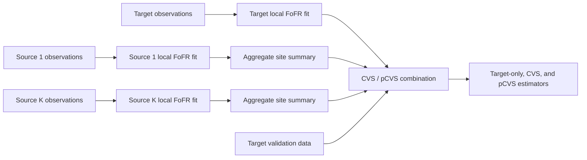

# fofrCVS

[](https://www.r-project.org/)
[](https://github.com/UfukBeyaztas/fofrCVS)
[](https://www.gnu.org/licenses/gpl-3.0.html)

**Control-variates transfer learning for function-on-function regression**

`fofrCVS` implements target-only, feasible control-variates (CVS), and
penalized control-variates (pCVS) estimation for function-on-function linear
regression with multiple functional predictors and optional scalar covariates.
The package supports both centralized analysis and a distributed workflow in
which source studies transmit aggregate model summaries rather than
subject-level observations.

The complete package documentation is available in the
[fofrCVS reference manual](fofrCVS_1.0.0.pdf).

## Model and methodology

For study \(k\), the package considers the mixed-predictor model

$$
Y_i^{(k)}(t)-\mu_Y^{(k)}(t) = \sum_{p=1}^{P}\int_{\mathcal S} \{X_{ip}^{(k)}(s)-\mu_{X_p}^{(k)}(s)\} \beta_p^{(k)}(s,t) ds +\{\boldsymbol w_i^{(k)}-\boldsymbol\mu_W^{(k)}\}^{\mathsf T} \boldsymbol\alpha^{(k)}(t) +\varepsilon_i^{(k)}(t).
$$

Study 0 is the target and studies \(1,\ldots,K\) are sources. Functional
predictors and responses are represented in common predictor and response
bases, while the local coefficient surfaces are estimated by penalized least
squares.

Three estimators are available:

- **Target-only** (`method = "local"`) uses the target study alone.
- **CVS** (`method = "CVS"`) applies a precision-weighted control-variates
  correction based on centered target–source coefficient differences.
- **pCVS** (`method = "pCVS"`) regularizes source-specific discrepancies in
  the integrated coefficient-function geometry. This provides protection
  against negative transfer when some source regression operators differ from
  the target operator.

The pCVS path contains the exact Target-only endpoint at `zeta = 0`. A pCVS
estimate can be selected with an independent target validation sample or by
supplying a fixed nonnegative value of `zeta`.

## Installation

Install the current GitHub version with:

```r
install.packages("remotes")
remotes::install_github("UfukBeyaztas/fofrCVS")
```

Then load the package:

```r
library(fofrCVS)
```

`fofrCVS` depends only on packages distributed with R.

## Quick start

The package includes a data generator with two functional predictors and two
scalar covariates. In the example below, the first source is transferable,
whereas the second has shifted regression effects.

```r
library(fofrCVS)

s_grid <- seq(0, 1, length.out = 101)
t_grid <- seq(0, 1, length.out = 101)

target <- simulate_fofr_data(
  n = 50,
  s_grid = s_grid,
  t_grid = t_grid
)

source_1 <- simulate_fofr_data(
  n = 100,
  s_grid = s_grid,
  t_grid = t_grid,
  covariance_scale = 7
)

source_2 <- simulate_fofr_data(
  n = 100,
  s_grid = s_grid,
  t_grid = t_grid,
  effect = "shifted"
)

validation <- simulate_fofr_data(
  n = 50,
  s_grid = s_grid,
  t_grid = t_grid
)

fit <- fit_cvs_fofr(
  datasets = list(target, source_1, source_2),
  x_basis_type = "bspline",
  y_basis_type = "bspline",
  Mx = 5,
  My = 5,
  variance_method = "model",
  target_validation = validation
)

fit
```

The first element of `datasets` is always the target study. All subsequent
elements are treated as source studies. The validation sample is used only to
select the pCVS penalty; it is not included in any local model fit.

### Coefficients and predictions

```r
# Tensor-product basis coefficients
coef_local <- coef(fit, method = "local")
coef_cvs   <- coef(fit, method = "CVS")
coef_pcvs  <- coef(fit, method = "pCVS")

# Prediction for new target observations
new_target <- simulate_fofr_data(
  n = 20,
  s_grid = s_grid,
  t_grid = t_grid
)

predicted_curves <- predict(
  fit,
  newdata = new_target,
  method = "pCVS"
)

dim(predicted_curves)
```

### Reconstructing a coefficient surface

```r
activity_surface <- coefficient_surface(
  fit,
  predictor = "activity",
  method = "pCVS",
  s_grid = s_grid,
  t_grid = t_grid
)

persp(
  activity_surface$s_grid,
  activity_surface$t_grid,
  activity_surface$beta,
  theta = 35,
  phi = 25,
  expand = 0.65,
  shade = 0.45,
  col = "lightblue",
  ticktype = "detailed",
  xlab = "s",
  ylab = "t",
  zlab = expression(hat(beta)(s, t))
)
```

### Reconstructing a scalar effect

```r
continuous_effect <- scalar_effect(
  fit,
  covariate = "continuous",
  method = "pCVS",
  t_grid = t_grid
)

plot(
  continuous_effect$t_grid,
  continuous_effect$alpha,
  type = "l",
  lwd = 2,
  xlab = "t",
  ylab = expression(hat(alpha)[1](t))
)
```

## Distributed fitting

The centralized interface above is convenient when all study-level data are
available in one environment. When source data must remain at their original
institutions, the same estimators can be computed from exported site
summaries.



All sites must use identical basis definitions and the same ordered functional
predictors and scalar covariates.

```r
x_basis <- fofr_basis("bspline", M = 5, boundary = c(0, 1))
y_basis <- fofr_basis("bspline", M = 5, boundary = c(0, 1))

# At the target site
target_fit <- fit_local_fofr(
  dataset = target,
  x_basis = x_basis,
  y_basis = y_basis,
  variance_method = "model"
)

# At each source site
source_1_summary <- fofr_site_summary(
  fit_local_fofr(
    dataset = source_1,
    x_basis = x_basis,
    y_basis = y_basis,
    variance_method = "model"
  )
)

source_2_summary <- fofr_site_summary(
  fit_local_fofr(
    dataset = source_2,
    x_basis = x_basis,
    y_basis = y_basis,
    variance_method = "model"
  )
)

# Back at the target or coordinating site
distributed_fit <- combine_cvs_fofr(
  target_fit = target_fit,
  source_summaries = list(source_1_summary, source_2_summary),
  target_validation = validation
)

distributed_fit
```

`fofr_site_summary()` exports the local coefficient estimate, its plug-in
conditional mean and covariance estimate, and basis metadata. It does not
include response curves, functional predictors, scalar covariates, or
subject-specific residuals. These summaries are not, however, a formal
differential-privacy mechanism; institutional disclosure-control requirements
remain applicable.

## Required data structure

Each target, source, validation, or prediction data set is supplied as a list:

| Component | Description |
|---|---|
| `Y` | An \(n\times J_t\) matrix of response curves. Required for fitting and validation. |
| `y_grid` | Strictly increasing response-domain grid of length \(J_t\). |
| `X_list` | Named list of functional-predictor matrices; each matrix has \(n\) rows. |
| `x_grids` | Named list containing the observation grid for each element of `X_list`. |
| `w` | Optional \(n\times Q\) matrix of scalar covariates. |

The target and sources may be recorded on different grids, provided that all
grids lie within the common basis boundaries. Predictor and covariate names,
counts, and ordering must agree across studies.

## Main functions

| Function | Purpose |
|---|---|
| `fit_cvs_fofr()` | Fit the complete Target-only, CVS, and pCVS procedure from target and source data sets. |
| `fofr_basis()` | Construct Fourier or B-spline bases and their Gram and roughness matrices. |
| `fit_local_fofr()` | Fit a penalized mixed-predictor FoFR model at one study. |
| `fofr_site_summary()` | Create the aggregate summary transmitted by a source site. |
| `combine_cvs_fofr()` | Combine a target fit and source summaries by CVS and pCVS transfer. |
| `coef()` | Extract basis coefficients for the selected estimator. |
| `predict()` | Predict functional responses on a supplied response grid. |
| `coefficient_surface()` | Reconstruct a bivariate function-on-function coefficient surface. |
| `scalar_effect()` | Reconstruct a response-varying scalar coefficient function. |
| `simulate_fofr_data()` | Generate mixed-predictor functional data for examples and methodological studies. |

For mathematical details, argument definitions, returned components, and
numerical diagnostics, consult the
[reference manual](fofrCVS_1.0.0.pdf) or use the package help system:

```r
help(package = "fofrCVS")
?fit_cvs_fofr
?combine_cvs_fofr
```

## Practical notes

- Use an independent target validation sample to select `zeta` when prediction
  is the primary objective.
- If no validation sample is supplied, provide `zeta` explicitly to obtain a
  selected pCVS estimate. Otherwise, the complete path is returned without a
  selected `gamma_pcvs`.
- Inspect the printed rank, condition-number, convergence, and KKT diagnostics
  before interpreting a fitted model.
- Coefficient surfaces can be weakly identifiable even when predictions are
  accurate. Estimation and prediction should therefore be assessed jointly.

## Citation

If you use `fofrCVS` in research, please cite the accompanying manuscript:

> Beyaztas, U., Mutis, M., Gurer, S. and Bandyopadhyay, S. (2026).
> *Transfer learning by control variates for function-on-function linear
> regression*. Manuscript.

BibTeX entry:

```bibtex
@unpublished{BeyaztasEtAl2026,
  author = {Beyaztas, Ufuk and Mutis, Muge and Gurer, Sude and
            Bandyopadhyay, Soutir},
  title  = {Transfer Learning by Control Variates for
            Function-on-Function Linear Regression},
  year   = {2026},
  note   = {Manuscript}
}
```

## Authors

The methodology was developed by Ufuk Beyaztas, Muge Mutis, Sude Gurer, and
Soutir Bandyopadhyay. The R package is maintained by
[Ufuk Beyaztas](https://github.com/UfukBeyaztas).

## License

`fofrCVS` is distributed under the
[GNU General Public License, version 3](https://www.gnu.org/licenses/gpl-3.0.html).

## Issues

Bug reports and reproducible examples are welcome through the
[GitHub issue tracker](https://github.com/UfukBeyaztas/fofrCVS/issues).
